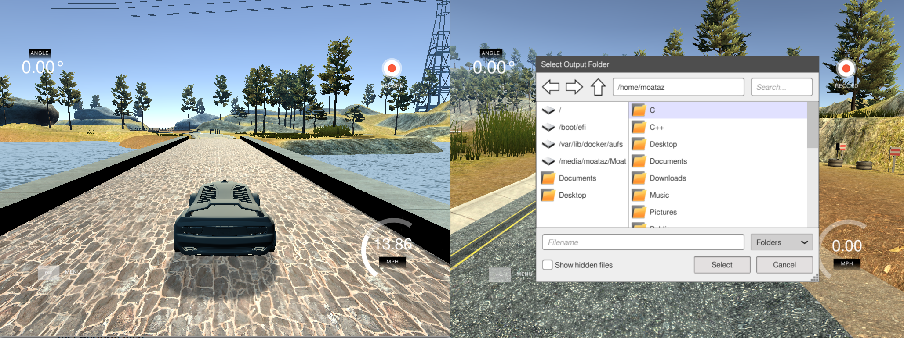
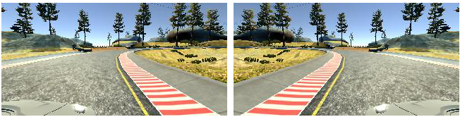
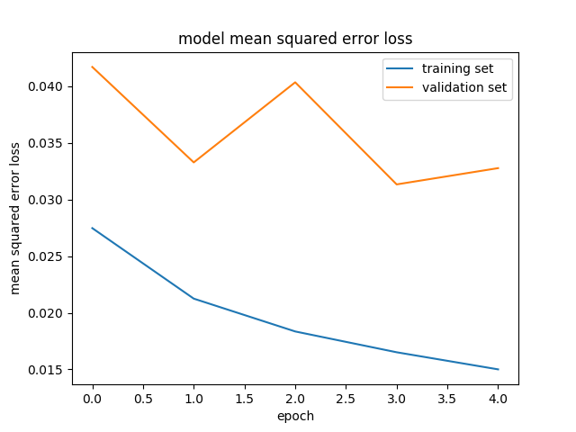
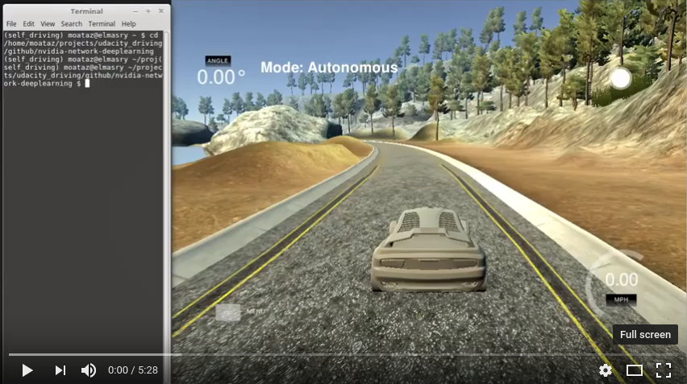

# Deep Learning on Car Simulator

In the third project of the self-driving car engineer course, I used a car simulator provided by the course organizers to collect data on expected driving behaviour, then used that data to train a deep learning CNN model ([NVIDIA convolutional neural network architecture](https://devblogs.nvidia.com/deep-learning-self-driving-cars/)) to drive the car in the simulated environment.

The project consisted of the following stages:

1. Collect training data by driving the car around the simulator.
2. Implement the NVIDIA neural network.
3. Train and test model performance.


## Collecting training data

The simulator can be run in two modes: training mode and autonomous mode. 

In training mode, the user controls the movement of the car using the steering angle, throttle, and brakes. You can control the car using the keyboard or the mouse. During training mode, you can hit the record key and the simulator will start saving the driving data to a specific location. The driving data consists of each image from the left, right, and front cameras (160x320x3 dimensions) of the car as well as the corresponding steering, throttle, and brake measurements.



To collect the training data, the car was driven in training mode around the track for two full laps using center lane driving behaviour. The data was then further reinforced with selective driving behaviour around corners to account for over-steer and under-steer, this allowed the model to learn the larger steering angle required to go around these corners.

In total, 7,098 data points were collected from the training run. Further augmentation was performed by flipping the images horizontally and finding the additive inverse of the steering angle. After augmentation, the total number of data points doubled to 14,196 points.



## Implementing NVIDIA neural network

For this project, the [Keras](https://keras.io/) deep learning library was used.

As an initial model, I implemented a neural network with just one convolutional layer and one densely connected layer. Steering angle was the sole measurement used as an output for the model; the addition of throttle and braking measurements added noise to the driving behaviour. This rudimentary model was able to keep the car on the road during the straight segments of the track but failed to steer the car properly around corners.

To improve my solution, I decided to use the NVIDIA neural network architecture described [here](https://devblogs.nvidia.com/deep-learning-self-driving-cars/) on their developer blog. Quote from their article:

> In a new automotive application, we have used convolutional neural networks (CNNs) to map the raw pixels from a front-facing camera to the steering commands for a self-driving car. This powerful end-to-end approach means that with minimum training data from humans, the system learns to steer, with or without lane markings, on both local roads and highways.

The following is a diagram of the NVIDIA neural network architecture taken from their blog:


The NVIDIA neural network above consists of 9 layers: 1 normalization layer, 5 convolutional layers, and 3 fully connected layers. 

**My implementation of the CNN differed slightly, I had in total 12 layers: 1 cropping layer, 1 normalization layer, 4 convolutional layers, 3 dropout layers, and 3 fully connected layers.**

Cropping layers were used to remove scenery (trees, water, etc..) from the input data, so that the model can focus on the road features. Input images were cropped 70 pixels from the top and 25 pixels from the bottom. Also dropout layers were added to reduce over-fitting as per the recommendation of the paper titled [Dropout: A Simple Way to Prevent Neural Networks from Overfitting](http://jmlr.org/papers/volume15/srivastava14a.old/srivastava14a.pdf) by University of Toronto researcher [Nitish Srivastava](https://scholar.google.co.uk/citations?user=s1PgoeUAAAAJ&hl=en). 

The following is a detailed description of each layer:

| Layer         		|     Description	        							| 
|:---------------------:|:-----------------------------------------------------:| 
| Input         		| 160x320x3 RGB image   								|
| Cropping				| 70px top, 25px bottom. outputs 160x225x3				|
| Normalization     	| 1x1 stride, valid padding, outputs 28x28x6 			|
| Convolutional			| 24 filters, 5x5 kernel, 2x2 stride. ReLU activation.	|
| Convolutional			| 36 filters, 5x5 kernel, 2x2 stride. ReLU activation.	|
| Convolutional			| 48 filters, 5x5 kernel, 2x2 stride. ReLU activation.	|
| Convolutional			| 64 filters, 3x3 kernel, 2x2 stride. ReLU activation.	|
| Flatten				| 														|
| Dropout				| 30% drop out rate.									|
| Dense					| output dimension: 100									|
| Dropout				| 30% drop out rate.									|
| Dense					| output dimension: 50									|
| Dropout				| 30% drop out rate.									|
| Dense					| output dimension: 1									|


And the following is the code implementation of the above layers in Keras:

```python
# Convolutional deep neural network based on the NVIDIA network.
model = Sequential()
model.add(Cropping2D(cropping=((70, 25), (0, 0))))
model.add(Lambda(lambda x: x / 255.0 - 0.5, input_shape=(160, 225, 3)))
model.add(Conv2D(24, (5, 5), strides=(2, 2), activation='relu'))
model.add(Conv2D(36, (5, 5), strides=(2, 2), activation='relu'))
model.add(Conv2D(48, (5, 5), strides=(2, 2), activation='relu'))
model.add(Conv2D(64, (3, 3), strides=(2, 2), activation='relu'))
model.add(Flatten())
model.add(Dropout(0.3))
model.add(Dense(100))
model.add(Dropout(0.3))
model.add(Dense(50))
model.add(Dropout(0.2))
model.add(Dense(1))
model.compile(loss='mse', optimizer='adam')

```

## Train & Test Performance

Training data was split with 80% of the data used for training and 20% of the data used for validation. Data was shuffled before it was split. The performance metric used was the mean squared error loss, with the aim to minimize it as much as possible.

After experimentation, I found out that the ideal number of epochs to train the model was 5 epochs, epochs larger than 10 tended to over-fit the model.

The model was fit using an [adam optimizer](https://arxiv.org/pdf/1412.6980v8.pdf), so the learning rate didn't have to be tuned manually.

The following image shows the mean squared error loss on the training and validation sets for each epoch:



As expected, the mean squared error loss of both the training and validation sets decreased with the number of times the model is trained (epochs).

At the end of the training process, the model was able to steer the vehicle autonomously around the track without the vehicle leaving the road. The following is a video of model in action:

[](https://www.youtube.com/watch?v=Y0efinhHRbk)
